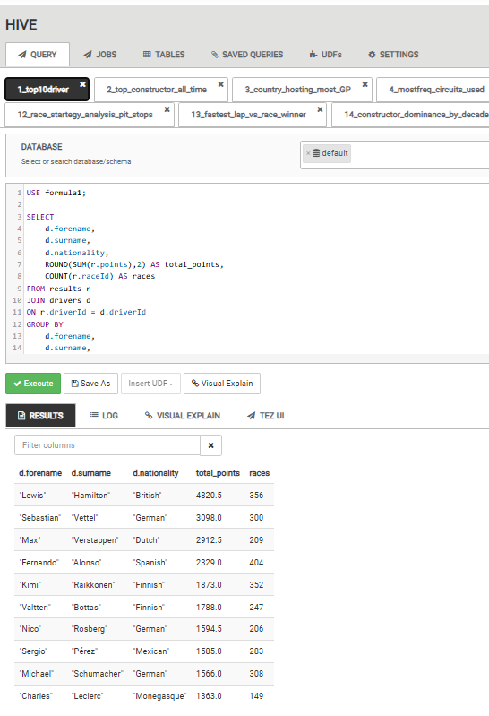

# 🏎️ Formula One Performance Analytics
### A Big Data Approach to Driver, Constructor, and Race Strategy Analysis (1950–2024)

---

## 📖 Project Overview

This project demonstrates how Big Data technologies and modern Data Science techniques can be integrated to analyse over seven decades of Formula One World Championship data (1950–2024).

The project combines the Hadoop ecosystem with Python-based analytics to transform historical Formula One datasets into meaningful business intelligence, interactive dashboards, and predictive models.

Two complementary analytical approaches were implemented:

- **Approach 1:** HDFS + Apache Hive + Apache Zeppelin (Descriptive Analytics)
- **Approach 2:** Python + Pandas + Plotly + Scikit-Learn (Advanced Analytics & Machine Learning)

---

# 🎯 Project Objectives

- Analyse Formula One historical data from 1950–2024.
- Develop Big Data analytical pipelines using Apache Hive.
- Create executive dashboards using Apache Zeppelin.
- Perform advanced exploratory analytics using Python.
- Discover hidden performance patterns using Machine Learning.
- Predict Formula One race winners using Random Forest.

---

# 🏗 System Architecture

```

Formula One CSV Dataset

↓

HDFS

↓

Apache Hive

↓

Apache Zeppelin Dashboard

↓

Python

↓

Pandas

↓

Plotly

↓

Scikit-Learn

↓

Machine Learning

↓

Business Insights

```

---

# 🛠 Technologies Used

| Category | Technology |
|-----------|------------|
| Programming | Python |
| Big Data | Hadoop, HDFS |
| Data Warehouse | Apache Hive |
| Dashboard | Apache Zeppelin |
| Data Processing | Pandas |
| Visualization | Plotly |
| Machine Learning | Scikit-Learn |
| SQL | Hive SQL |
| Version Control | Git & GitHub |

---

# 📂 Repository Structure

```text
Formula1-Performance-Analytics/

│

├── README.md

├── LICENSE

├── requirements.txt

│

├── hive/

│ ├── 01_top_drivers.sql

│ ├── 02_top_constructors.sql

│ ├── ...

│ └── 15_executive_dashboard.sql

│

├── zeppelin/

│ └── Formula1_Dashboard.json

│

├── python/

│ └── F1_Approach2_Python_Advanced_Analytics.ipynb

│

├── screenshots/

│

└── architecture/

```

---

# 📊 Analytical Workflow

## 🔹 Approach 1 – Big Data Analytics

- Data Storage using HDFS
- SQL Analytics using Apache Hive
- Dashboard Development using Apache Zeppelin
- Executive Dashboard (15 Analytical Insights)

### Key Analyses

- Top Formula One Drivers
- Top Constructors
- Countries Hosting Grand Prix
- Championship Growth
- Driver Efficiency
- Pole Position Conversion Rate
- Constructor Dominance
- Driver Consistency Index
- Pit Stop Strategy
- Fastest Lap Analysis

---

## 🔹 Approach 2 – Advanced Analytics

Advanced analytical techniques were developed using Python.

### Exploratory Data Analysis

- Driver Performance Trend
- Constructor Performance Evolution
- Correlation Analysis
- Grid Position vs Finishing Position
- Pit Stop Strategy Analysis

### Machine Learning

- Driver Clustering (K-Means)
- Race Winner Prediction (Random Forest)

---

# 📈 Key Findings

- Lewis Hamilton accumulated the highest championship points in Formula One history.
- Ferrari remains the most successful constructor across all championship seasons.
- Italy has hosted the highest number of Formula One Grand Prix events.
- Driver efficiency has improved significantly during the modern Formula One era.
- Pole position does not always guarantee race victory.
- Fastest lap alone is not a reliable predictor of race success.
- Race strategy plays a significant role in determining final race outcomes.
- Machine learning successfully classified drivers into meaningful performance groups.

---

# 🤖 Machine Learning Models

## K-Means Clustering

Objective:

Identify natural driver performance groups based on:

- Career Wins
- Championship Points
- Podium Finishes
- Race Starts

---

## Random Forest Classifier

Objective:

Predict Formula One race winners using:

- Starting Grid Position
- Constructor
- Driver

---

# 📷 Dashboard Preview

## 🏆 Hive + Zeppelin Dashboard

### Top Formula One Drivers



---


---

### Championship Growth (1950–2024)


---

## 🐍 Python Advanced Analytics

### Driver Performance Trend


---

### Constructor Performance Evolution


---

### Driver Clustering (K-Means)


---

### Random Forest Feature Importance


---

# 🚀 Future Improvements

Future work may include:

- Weather Analysis
- Tyre Compound Analysis
- Driver Telemetry
- XGBoost Models
- Deep Learning
- Real-time Dashboard using Streamlit

---

# 📚 Dataset

Formula One World Championship Dataset (1950–2024)

Primary datasets include:

- circuits.csv
- constructors.csv
- drivers.csv
- races.csv
- results.csv
- qualifying.csv
- pit_stops.csv

---

# 👨‍💻 Author

**Shukeri**

Master of Data Science & Analytics

Universiti Kebangsaan Malaysia (UKM)

---

# ⭐ Acknowledgements

This project was developed as part of the Data Management coursework and demonstrates the integration of Big Data technologies with modern Data Science techniques for motorsport analytics.
